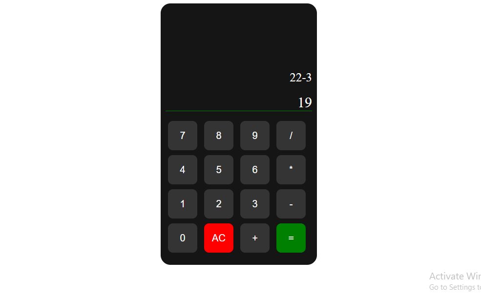

# Simple Calculator

This is a basic calculator web application created using HTML, CSS, and JavaScript.

## Features
- Addition, subtraction, multiplication, and division operations.

## How to Use
1. Open the `index.html` file in your preferred web browser.
2. The calculator interface will appear, allowing you to input numbers and perform basic operations.
3. Click on the numeric and operator buttons to build your expression.
4. Press the "=" button to see the result.
5. The "C" button clears the current input.

## Files
- `index.html`: The main HTML file containing the structure of the calculator.
- `style.css`: The CSS file for styling the calculator interface.
- `script.js`: The JavaScript file handling the calculator logic.

## Customize
Feel free to modify the styles in `style.css` or enhance the functionality in `script.js` to suit your preferences.

## Author
[Mousumi Layek](https://github.com/layekmousumi)

## License
This project is licensed under the [MIT License](LICENSE.md).